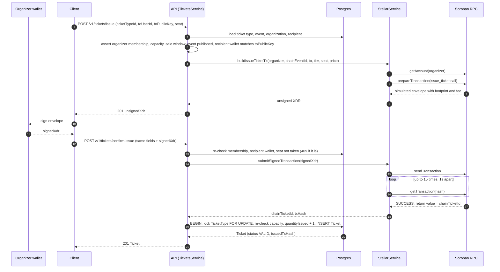
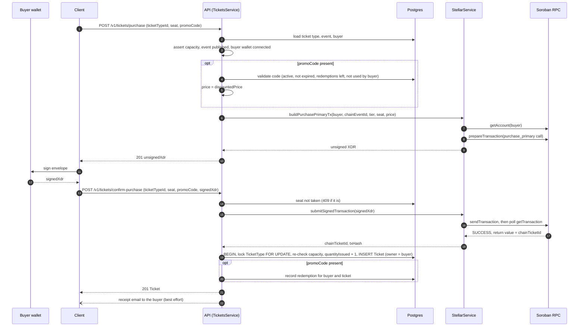
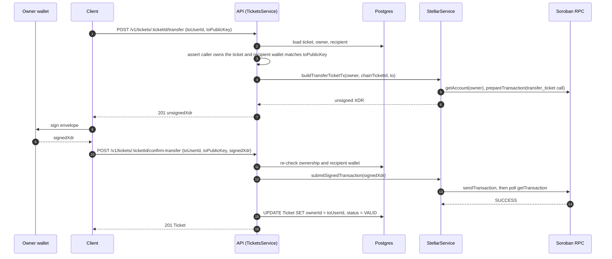
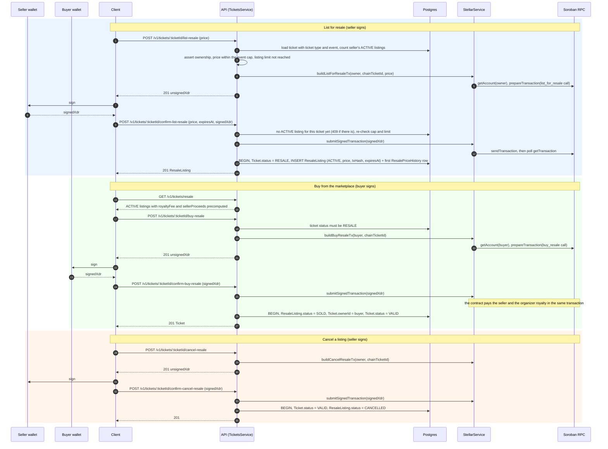
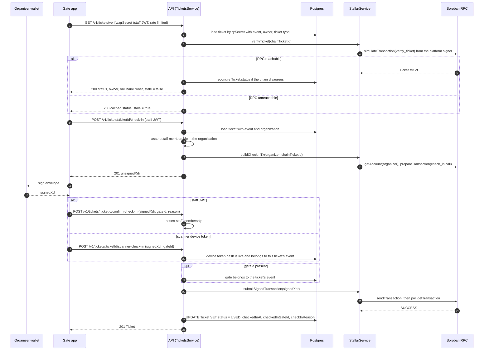
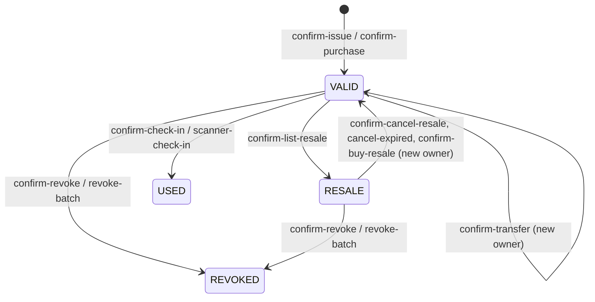

# Architecture

## Module layout

- `auth` — registration, login, JWT issuance and validation
- `users` — profile, wallet connect, email lookup for recipient resolution
- `organizations` — organizer accounts and membership
- `events` — event/ticket-type CRUD and on-chain publishing
- `tickets` — the full ticket lifecycle (issue, purchase, transfer,
  check-in, revoke, resale)
- `stellar` — the only module that talks to Soroban RPC

## The non-custodial write path

Every on-chain write follows the same two-step shape:

1. `build*Tx` in `StellarService` simulates the call against the
   caller's own public key and returns an unsigned XDR envelope.
2. The caller's wallet signs it client-side.
3. `submitSignedTransaction` relays the signed envelope and polls it
   to completion.

No other module calls Soroban RPC directly — they all go through
`StellarService`, which keeps the "we never hold a key" invariant in
one place.

## Ticket lifecycle

The diagrams below trace each ticket action through the same
participants:

| Participant | What it is |
|---|---|
| Wallet | The signer's browser wallet (Freighter etc.). Holds the private key; the API never sees it. |
| Client | Dashboard, marketplace or scanner app calling the REST API with a JWT. |
| API | The NestJS controller and service for the route, `TicketsService` unless stated otherwise. |
| Postgres | The Prisma read-model: `Ticket`, `TicketType`, `ResaleListing`, and so on. The contract stays the source of truth. |
| StellarService | Builds envelopes, relays signed ones and runs read-only simulations. |
| Soroban RPC | The network endpoint. Every `build` call ends in `prepareTransaction`, which simulates the call and attaches footprint and fee. |

Conventions shared by every flow:

- `build` endpoints (`POST /v1/tickets/issue`, `POST /v1/tickets/:ticketId/transfer`, ...) return `{ unsignedXdr }`. They accept an optional `Idempotency-Key` header so a retried request replays the same envelope instead of building a new one.
- `confirm-*` endpoints take the wallet-signed envelope back as `signedXdr` and re-run the authorization checks before relaying it, so a stale or replayed envelope cannot bypass a rule that changed in between.
- `submitSignedTransaction` sends the envelope, then polls `getTransaction` once a second for up to fifteen seconds. A rejected submission, an on-chain failure or a timeout surfaces as an error and nothing is written to Postgres.
- Postgres writes happen only after the chain confirms. The `Ticket.status` column mirrors the on-chain `TicketStatus` and is reconciled again on every `verify` call.
- Every identifier the contract uses is a `u64` (`chainEventId`, `chainTicketId`) and every price is an `i128`, so both travel through JSON as strings.

### Issue (organizer hands out a ticket)

An organizer issues a ticket to an attendee when payment settled off-chain
(a comp, a sponsor allocation, a box-office sale). The organizer's
organization account is the transaction source and signs.

### Purchase (attendee buys at face value)

The buyer is the transaction source, so the buyer's wallet signs and
the payment settles inside the same contract call that creates the
ticket. A promo code, when supplied, is validated at build time to
compute the discounted price and redeemed only after the chain
confirms.

### Transfer (owner gives a ticket to another user)

The current owner is the source. The recipient must already have a
wallet connected, and the `toPublicKey` in the request has to match it,
so a ticket cannot be sent to an address the platform cannot link to an
account.

### Resale (list, buy, cancel)

Resale is three actions on the same ticket. Listing and cancelling are
signed by the owner, buying by the buyer. Two rules are enforced
off-chain before the envelope is built and again at confirm time:
the asking price may not exceed `floor(facePrice * maxResaleMultiplierBps / 10000)`
for the event, and a seller may hold at most
`MAX_ACTIVE_RESALE_LISTINGS_PER_USER` active listings (default 5). The
contract enforces the same cap on-chain; the off-chain check only turns
a failed simulation into a clear 400.

Two off-chain paths touch a listing without a wallet signature because
they change nothing on-chain: `PATCH /v1/tickets/resale/:listingId/price`
records a new asking price (validated against the same cap and appended
to `ResalePriceHistory`), and `POST /v1/tickets/resale/cancel-expired`,
also run on a schedule, flips listings past their `expiresAt` back to
`CANCELLED` and their tickets back to `VALID`. See
[RESALE_EXPIRY.md](RESALE_EXPIRY.md).

### Check-in (gate marks a ticket used)

Two callers can check a ticket in: a staff member with a JWT, and a
registered scanner device with its own bearer token. Both end in the
same `check_in` contract call, signed by the organizer's organization
account, and the same Postgres update. Before scanning, the gate app
usually verifies the QR code, which is a read-only simulation.

When the gate has no connectivity at all, the scanner verifies an
Ed25519-signed offline token instead of calling `verify`; see
[OFFLINE_VERIFICATION.md](OFFLINE_VERIFICATION.md).

### Revoke (organizer voids a ticket)

Revocation follows the check-in shape with `revoke_ticket` and ends in
`status = REVOKED`. `POST /v1/tickets/events/:eventId/revoke-batch`
revokes up to 100 tickets in the read-model only, for fraud response
where per-ticket signing would be too slow.

### Ticket status transitions

`Ticket.status` is a cached projection of the on-chain enum. These are
the transitions the flows above produce:

`GET /v1/tickets/verify/:qrSecret` overwrites the cached status with
whatever the contract reports, so a transition made outside this API
(another client calling the contract directly) becomes visible on the
next scan.
